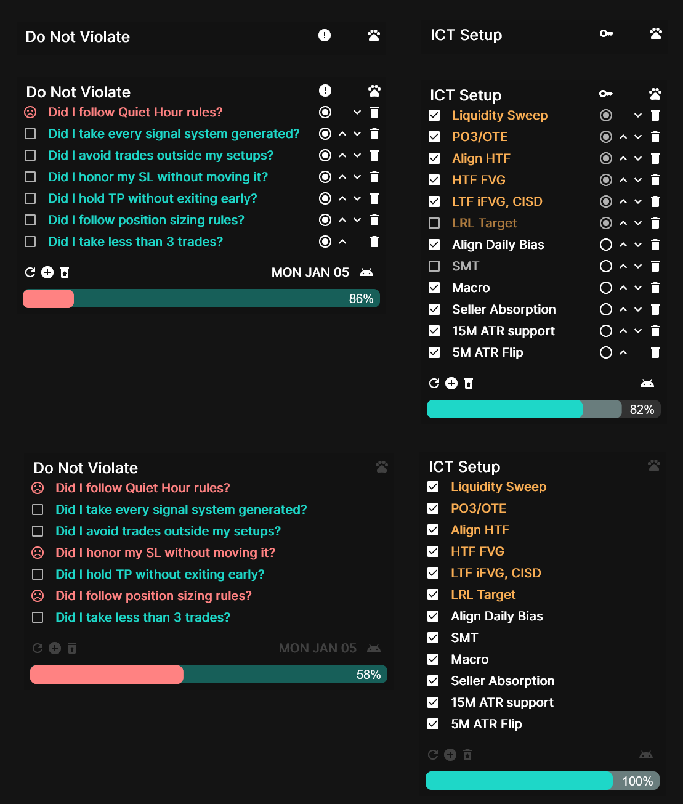
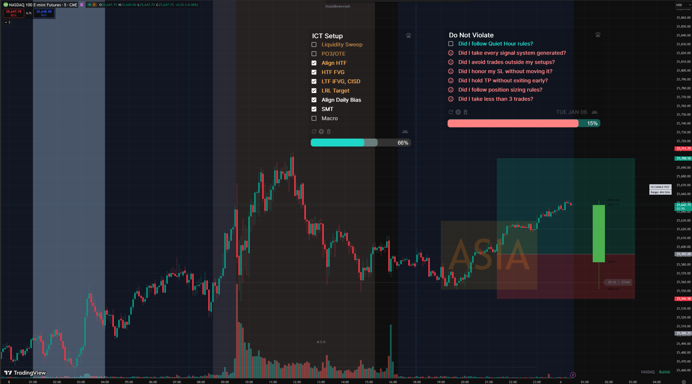
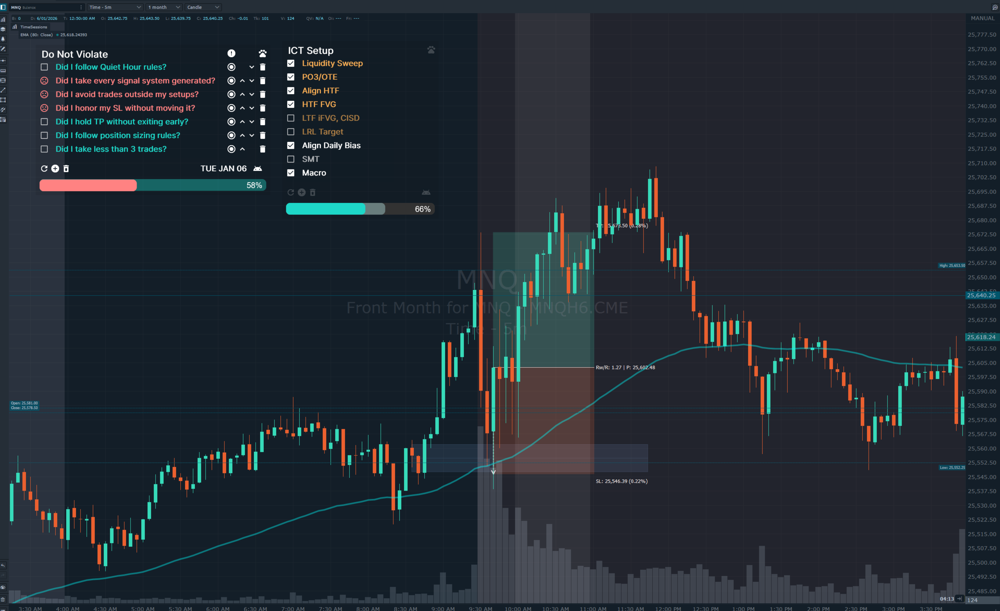
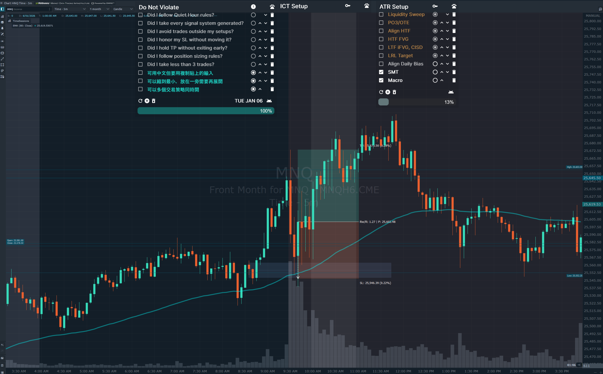
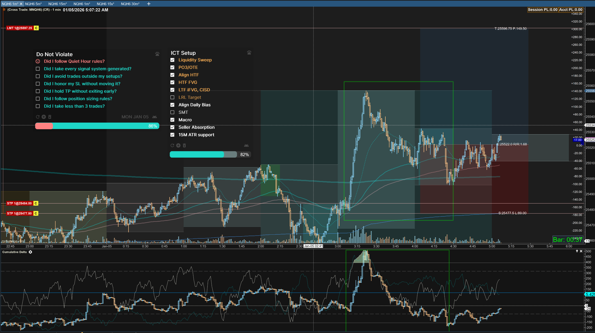

# ✔️ Rainmeter Trading Tracker

A small Rainmeter widget to help track trading setups and monitor daily trading rules. Designed for traders who want a quick reference while taking screenshots for their trading journey.
This project is based on [rainmeter-todo](https://github.com/alperenozlu/rainmeter-todo), with additional features tailored for trading, including setup tracking, rule checks, progress bars, and percentages.

## 🎞️ Preview

Here are some preview photos you can check out.

## 📝 Features

- Add, Delete and Reorder criteria for your trading setups
- Mark the criteria/rule as major
- Recover deleted criteria/rules from the trash bin
- Hide edit options for a cleaner widget
- Minimize the widget to show only the title
- Show Date and Time on the widget
- Can choice the widget size by menu
- Can be in Chinese, but needs to be copy-pasteable.
- Highly customizable

## Install

1. Install [Rainmeter](https://www.rainmeter.net/) if you don’t have it already.
2. Load this skin in Rainmeter.
3. Customize your trading setups and daily rules to track your trades.
4. Use it while taking screenshots to document your trading journey.

###### Via Installer

+ Go to the [Releases](https://github.com/beer/rainmeter-trading-tracker/releases) page and download the latest .rmskin file.
+ Install skin with a double click to the downloaded file.
+ [Activate the skin](#activate-skin)

###### Via Source Code

- Download this source code and place the entire `rainmeter-trading-tracker` folder in the location of your Rainmeter skin. Generally it is look like `C:\Users\<USERNAME>\Documents\Rainmeter\Skins\`
- [Activate the skin](#activate-skin)

##### Activate Skin

- Activate `rainmeter-trading-tracker` skin
  - You can do this by right-clicking on an already active skin to bring up the Rainmeter menu
  - Navigate to `Rainmeter > Skins > rainmeter-trading-tracker > Setups/Rules > Large/Medium/Small.ini`
    - If you do not see `rainmeter-trading-tracker` in the skin selection, try navigating to `Rainmeter > Refresh all`

## 🖋️ Customize

1. Go to `Rainmeter > Skins > rainmeter-trading-tracker > Setups/Rules > Large/Medium/Small.ini` and click `Edit` button.
2. Edit the values you want to change. You can find information about which fields you can change in the table below.
3. After saving the file, you can see the changes by clicking the refresh button twice.
4. To create a new setup or rule, simply duplicate the folder and rename it to whatever you want.

| Name                	| Description                                      	| Possible Values   	| Default Value   	|
|---------------------	|--------------------------------------------------	|-------------------	|-----------------	|
| SolidColor          	| Background color of the skin                     	| Color Code        	| 0,0,0,150       	|
| SkinWidth           	| Width of the skin                                	| Number            	| 600             	|
| SHOW_RECURRING      	| Show/Hide Recurring column                       	| 0: False, 1: True 	| 1               	|
| SHOW_IMPORTANT      	| Show/Hide Important column                       	| 0: False, 1: True 	| 1               	|
| SHOW_DATE             | Show/Hide Date                                    | 0: False, 1: True   | 0                 |
| SHOW_TIME             | Show/Hide Time                                    | 0: False, 1: True   | 0                 |
| ACTIVE_TASK_COLOR   	| Color of the active task                         	| Color Code        	| FFFFFF          	|
| COMLETED_TASK_COLOR 	| Color of the completed task                      	| Color Code        	| 255,255,255,170 	|
| TRASH_LIMIT         	| Maximum number of deleted tasks to keep in trash 	| Number            	| 10              	|
| BUTTON_SIZE         	| Font size of icon buttons                        	| Number (px)       	| 18              	|
| BUTTON_COLOR        	| Font color of icon buttons                       	| Color Code        	| FEFEFE          	|
| FONT_FACE           	| Font type to be used                             	| Inter or Roboto   	| Inter           	|
| FONT_SIZE           	| Font size of texts                               	| Number (px)       	| 15              	|
| TITLE                 | Write what you want to show on title              | String              | ICT Setup         |

## 🤖 Technical Details & Notes

### 🗒️ Tasks and Editing Tasks Manually

In an emergency, you may want to edit the task file manually. For this, you must first know the structure of the task file.

- In the first line of the `tasks.txt` file, there is `task|x|x` information. This line should never be deleted. The program accepts this line as the title.

- Each line in the file is a task.

- Task's information is separated by  `|` character. The attribute belonging to a column is shown in the table below.  

| 1         | 2            | 3            | 4            |
| --------- | ------------ | ------------ | ------------ |
| Task Text | Is Completed | Is Recurring | Is Important |

For example, a completed and important task would look like this `task title|x||x` 
    
If it's just a completed task, it's look like `task title|x||` 

### ☁️ Sync With Multiple Device

Added and deleted tasks are stored on a file basis. Since there is no database connection, you can use programs such as Google Drive, Dropbox, and OneDrive to synchronize between multiple devices.

- Go to `rainmeter-trading-tracker` folder in your Rainmeter skins location
- Start the sync process for the folder you are using through the cloud program you use.

### 😔 Known Bugs and Issues
- If Windows commands are entered as a task, the relevant command is triggered.
- If the task contains the `'` character, it's not saved.
- The title is overlapping the input column.

PS: This widget is mainly for my personal use, so I’ll fix the issues above whenever I have free time.
